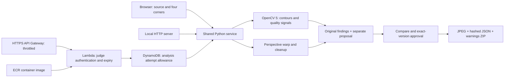

# CaptureGate

**Fix the frame. Keep the evidence. Let the person approve the handoff.**

Document capture review with OpenCV 5: automatic cleanup, reversible four-corner correction, visible crop-loss shading and a byte-matched human-reviewed export. Built by Redwan Rahman for OpenCV AI Competition 2026, with AI-assisted implementation and documentation.

## Submission status — 10 October 2026

[CaptureGate is submitted on Devpost](https://devpost.com/software/capturegate) to OpenCV AI Competition 2026, powered by AWS. Devpost shows **Submitted, 5/5 steps done**. The [published narrated demo](https://youtu.be/PQzTkfxN1WQ) is linked in the submission, along with this public repository and the protected AWS endpoint. Credentials were saved in the portal's private **Testing instructions** for judges and organizers, not in public materials. Submission does not establish eligibility, judge acceptance or an award.

## Run locally
Python 3.12; Node.js optional for controller tests. No API key or paid model required.

```sh
python -m venv .venv
# Windows: .venv\Scripts\Activate.ps1
# macOS/Linux: source .venv/bin/activate
python -m pip install -r requirements.txt
python server.py --port 4179
```

Open http://127.0.0.1:4179/ and try the generated scenarios. Use fictional documents only. Upload PNG/JPEG, select four corners or use automatic edges, compare with the original, adjust/undo/rotate/clean up, then explicitly accept the exact version. Orange shading shows excluded regions. The handoff ZIP contains reviewed.jpg, review.json with output SHA-256, and READ-ME.txt warnings. Changing the version clears acceptance. Manual approval never turns a failed whole-page check into an automatic pass.

```sh
python -m unittest -v
node --test test_web.cjs
node --test test_handoff_benchmark.cjs
python evaluate.py
```

Current source was retested on Windows on 10 October 2026: **75 Python tests, 46 controller tests, six synthetic crop-geometry cases and 36/36 procedural cases passed**. The controller tests use a simulated DOM, not physical touch hardware. Earlier Linux and Lambda results are dated separately in [the technical report](TECHNICAL_REPORT.md). Synthetic checks and reused development photos are not held-out accuracy or measured human benefit.

## Architecture


The local browser uses the loopback-only local server. The [password-protected AWS judge demo](https://yq4tqjkm2f.execute-api.us-east-1.amazonaws.com) was rechecked on 10 October 2026: missing/wrong credentials were rejected, all three UI assets matched this source byte-for-byte, and clean/missing-page fictional fixtures returned `review_ready`/`retake`. Recorded deployment limits are expiry **11 November 2026 at 00:00 UTC**, **1,000 lifetime analysis attempts** including tests, and API Gateway throttling of 1 request/second with burst 10. These are not monetary caps. See [judge access](JUDGE_ACCESS.md), [technical report](TECHNICAL_REPORT.md), [deployment](DEPLOYMENT.md) and [audit evidence](AUDIT_2026-10-10.md) for verification scope and remaining provenance limitations. The direct Lambda Function URL is a separate IAM-protected route, not the browser demo.

## Limits and licenses
Cleanup cannot recover missing text, severe blur, prove completeness or certify authenticity. Weak edges and nested rectangles remain difficult. No OCR or generative image model is used. User savings, OCR improvement and physical-touch performance are unmeasured. Local processing remains local; remote deployment uploads images to that service. Application non-persistence is not a compliance guarantee. Original photos are excluded from handoff ZIPs.

Private photos and cloud account details are excluded from this public release. MIT source license, not a public-domain dedication. Dependencies retain their own licenses. No COOL or agentic-special-prize qualification is claimed.
