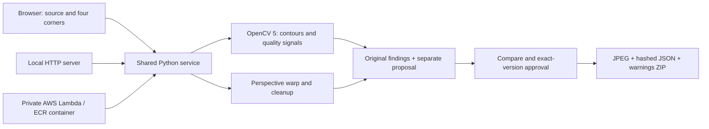

# CaptureGate

**Fix the frame. Keep the evidence. Let the person approve the handoff.**

Document capture review with OpenCV 5: automatic cleanup, reversible four-corner correction, visible crop-loss shading and a byte-matched human-reviewed export. Built by Redwan Rahman for OpenCV AI Competition 2026, with AI-assisted implementation and documentation.

## Run locally
Python 3.12; Node.js optional for controller tests. No API key or paid model required.

```sh
python -m venv .venv
# Windows: .venv\Scripts\Activate.ps1
# macOS/Linux: source .venv/bin/activate
python -m pip install -r requirements.txt
python server.py --port 4179
```

Open http://127.0.0.1:4179/ and try the generated scenarios. Use fictional documents only. Upload PNG/JPEG, select four corners or use automatic edges, compare with the original, adjust/undo/rotate/clean up, then explicitly accept the exact version. Orange shading shows excluded regions. The handoff ZIP contains reviewed.jpg, review.json with output SHA-256, and READ-ME.txt warnings. Changing the version clears acceptance. Manual approval never turns a failed whole-page check into an automatic pass.

```sh
python -m unittest -v
node --test test_web.cjs
node --test test_handoff_benchmark.cjs
python evaluate.py
```

67 Python tests passed in the Linux container, 46 controller tests locally and seven synthetic Lambda checks. Synthetic checks and reused development photos are not held-out accuracy or measured human benefit.

## Architecture


The local browser uses the local server. AWS runs the same service and performs actual image analysis. The deployed pilot is authenticated, not publicly accessible; judge screen-share arrangement remains pending. See [technical report](TECHNICAL_REPORT.md) and [deployment](DEPLOYMENT.md).

## Limits and licenses
Cleanup cannot recover missing text, severe blur, prove completeness or certify authenticity. Weak edges and nested rectangles remain difficult. No OCR or generative image model is used. User savings, OCR improvement and physical-touch performance are unmeasured. Local processing remains local; remote deployment uploads images to that service. Application non-persistence is not a compliance guarantee. Original photos are excluded from handoff ZIPs.

Private photos and cloud account details are excluded from this public release. MIT source license, not a public-domain dedication. Dependencies retain their own licenses. No COOL or agentic-special-prize qualification is claimed.
